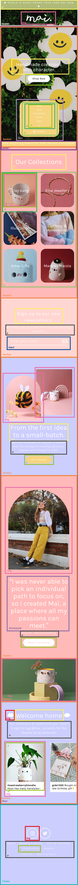
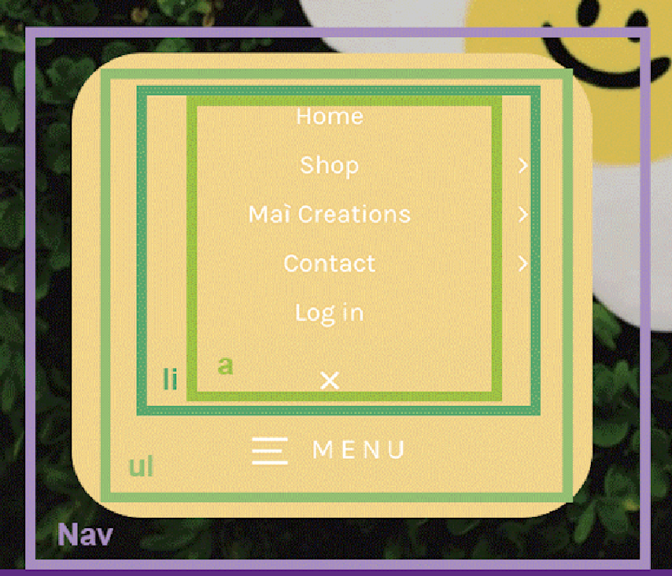
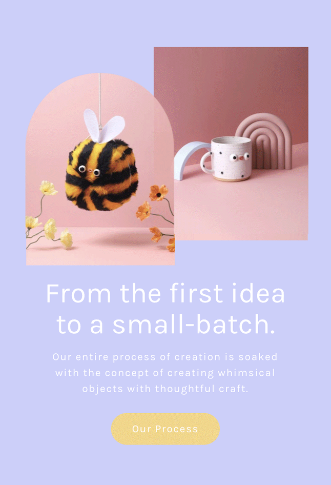
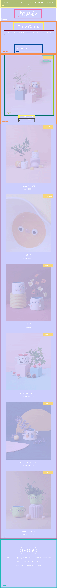
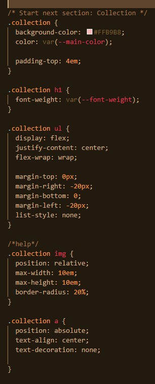
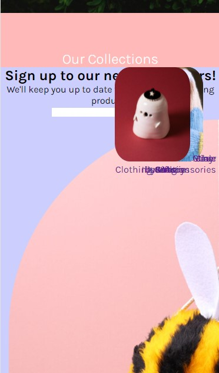
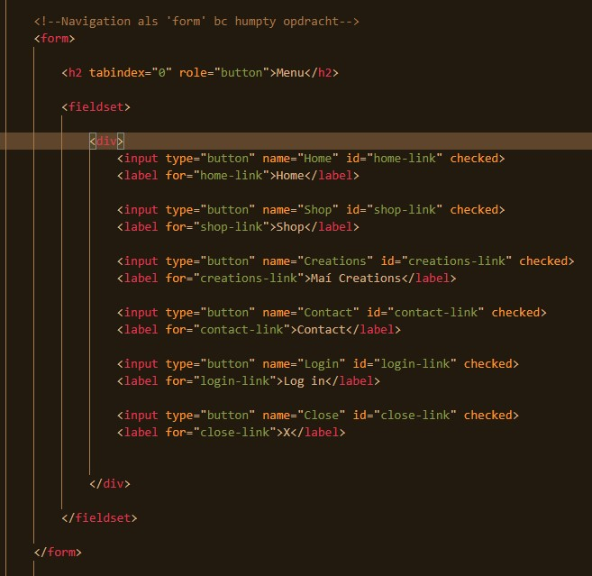
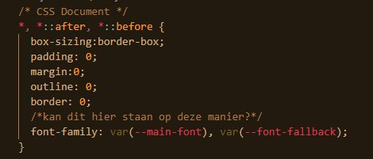

# Procesverslag
Markdown is een simpele manier om HTML te schrijven.  
Markdown cheat cheet: [Hulp bij het schrijven van Markdown](https://github.com/adam-p/markdown-here/wiki/Markdown-Cheatsheet).

Nb. De standaardstructuur en de spartaanse opmaak van de README.md zijn helemaal prima. Het gaat om de inhoud van je procesverslag. Besteedt de tijd voor pracht en praal aan je website.

Nb. Door *open* toe te voegen aan een *details* element kun je deze standaard open zetten. Fijn om dat steeds voor de relevante stuk(ken) te doen.

## Jij

uitwerken voor kick-off werkgroep

### Auteur:
Dilay Bayraktaroglu

#### Je startniveau:
Blauw

#### Je focus:
Surface
 

## Je website

uitwerken voor kick-off werkgroep

### Je opdracht:
mai-accents.com

#### Screenshot(s) van de eerste pagina (small screen): 
Home pagina

#### Screenshot(s) van de tweede pagina (small screen):
Shop

 

## Breakdownschets (week 1)

uitwerken na afloop 2e werkgroep

### de hele pagina: 

### dynamisch: 

tekst dat horizontaal scrollt

### wellicht nog een dynamisch deel:

menu

### dynamisch deel 3, als ik er tijd voor heb:

images 'ease-in'

### tweede pagina:

## Voortgang 1 (week 2)

uitwerken voor 1e voortgang

### Stand van zaken

Ik krijg de collection maar niet als een soort van grid met de tekst op de afbeeldingen

Form nav van de humpty opdracht?

vraag: fonts in * 

### Agenda voor meeting
samen met je groepje opstellen

| student 1      | student 2          | student 3    | student 4        |
| ---            | ---                | ---          | ---              |
| dit bespreken  | en dit             | en ik dit    | en dan ik dat    |
| en dat ook nog | dit als er tijd is | nog een punt | dit wil ik zeker |
| ...            | ...                | ...          | ...              |

### Verslag van meeting
hier na afloop snel de uitkomsten van de meeting vastleggen

- voor img/bg size: cover gebruiken 
- meer met flexbox werken
- menu op een andere manier - niet zoals de humpty opdracht
- h1/h2 checken
- nav weer toevoegen ipv form 

## Voortgang 2 (week 3)

uitwerken voor 2e voortgang

### Stand van zaken

De basis van de website is goed. Ben bijna klaar met mijn eerste html pagina. Ik ben nog niet toegekomen aan de tweede html pagina, maar die is makkelijker dan deze dus misschien heb ik dan minder stress.

Nu heb ik nog problemen met de navigatie, de 'collection' sectie, tekst schrijven bij de polaroids beneden. figcaption schrijven?

### Agenda voor meeting
samen met je groepje opstellen

| student 1      | student 2          | student 3    | student 4        |
| ---            | ---                | ---          | ---              |
| dit bespreken  | en dit             | en ik dit    | en dan ik dat    |
| en dat ook nog | dit als er tijd is | nog een punt | dit wil ik zeker |
| ...            | ...                | ...          | ...              |

### Verslag van meeting
hier na afloop snel de uitkomsten van de meeting vastleggen

- max width bij img > 100%
- h1 moeten h2s zijn: h1 is een titel
- vragen aan studentenassistenten vragen
- wel goed op weg maar moet specifieke dingen vragen

## Toegankelijkheidstest (week 4)

uitwerken na test in 8e voortgang

### Bevindingen
Lijst met je bevindingen die in de test naar voren kwamen:
- Hij leest niet alle headers voor
- tabben gaat goed
- wit op geel werkt niet
- let op kleur bij tekst. Er moet bij collection een zwarte overlay misschien op de fotos
- op de website veel lichte kleuren dus moet meer contrast erin
- grootte gaat goed wanneer je het groter maakt
- je moet veel lezen dus wanneer je concentratie problemen hebt ga je niet de hele pagina lezen
- tekst op collection misschien iets groter om meteen te kunnen zien waar je heen moet
- shop now is wel handig 
- op shoppagina meteen wel duidelijk wat er moet gebeuren en je kunt meteen zien wat het product is

## Voortgang 3 (week 4)

uitwerken voor 3e voortgang

### Stand van zaken
Ik ben begonnnen met het aanpassen van mijn website na de vorige les om het meer toegankelijk te maken. Ik gebruik de bevindingen als een checklist.

### Agenda voor meeting
samen met je groepje opstellen

| student 1      | student 2          | student 3    | student 4        |
| ---            | ---                | ---          | ---              |
| dit bespreken  | en dit             | en ik dit    | en dan ik dat    |
| en dat ook nog | dit als er tijd is | nog een punt | dit wil ik zeker |
| ...            | ...                | ...          | ...              |

### Verslag van meeting
hier na afloop snel de uitkomsten van de meeting vastleggen

- img werkte niet omdat hij in de folder moet zoeken. ..img voor fowers en .img voor clouds
- grotere margin bij de footer
- ...  

## Eindgesprek (week 5)

uitwerken voor eindgesprek

### Stand van zaken
hier dit ging goed & dit was lastig (neem ook screenshots op van delen van je website en code)

Ik heb ondertussen geprobeerd om alles responsive te maken maar het lukte niet echt, dus heb me maar gehouden aan de surface design. Javascript vind ik nog steeds een beetje lastig.
Ik vond eigenlijk alles wel lastig, maar denk dat ik het uiteindeljk wel goed heb gedaan.
Toen ik het op github had gezet, waren een aantal afbeeldingen niet meer te zien. Ik had blijkbaar de mappen niet goed ingedeeld, maar dat is ook gefixt. 
Dark mode heb ik ook toegevoegd.

### Screenshot(s)

## Bronnenlijst

continu bijhouden terwijl je werkt

Nb. Wees specifiek ('css-tricks' als bron is bijv. niet specifiek genoeg).

1. https://www.youtube.com/watch?v=T8EYosX4NOo&t=0s&ab_channel=KevinPowell
2. https://www.youtube.com/watch?v=T8EYosX4NOo&ab_channel=KevinPowell
3. https://medium.com/frontendshortcut/how-to-make-a-polaroid-photo-gallery-in-html-and-css-d68f5a306c84
4. https://www.w3.org/Style/Examples/007/center.en.html
5. https://stackoverflow.com/questions/18322548/black-transparent-overlay-on-image-hover-with-only-css
6. https://www.youtube.com/watch?v=wodWDIdV9BY&ab_channel=KevinPowell

